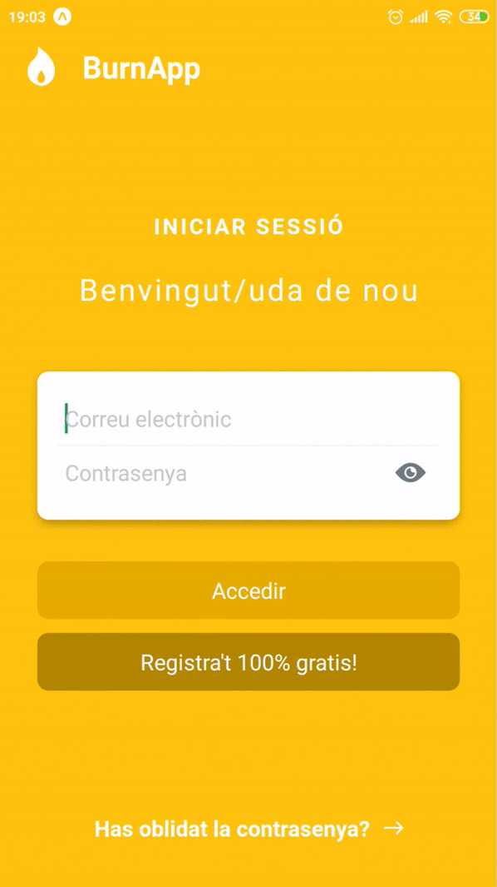

# React Native Expo Firebase BurnApp

React Native mobile application to pull work-related stress data.



The app was bootstrapped with [Create React Native App](https://github.com/react-community/create-react-native-app) and is running on Expo.

## Configuration
Add a `config/firebase.js` file with the following content (make sure to fill in the values from your own firebase account):

```
export default {
  API_KEY: <API_KEY>,
  AUTH_DOMAIN: <AUTH_DOMAIN>,
  DATABASE_URL: <DATABASE_URL>,
  PROJECT_ID: <PROJECT_ID>,
  STORAGE_BUCKET: <STORAGE_BUCKET>,
  MESSAGING_SENDER_ID: <MESSAGING_SENDER_ID>,
};
```

## How to run the app

Use the `yarn start`, `yarn ios`, or `yarn android` tasks as detailed below.

## Available Scripts

#### `yarn start`

Runs your app in development mode.

Open it in the [Expo app](https://expo.io) on your phone to view it. It will reload if you save edits to your files, and you will see build errors and logs in the terminal.

Sometimes you may need to reset or clear the React Native packager's cache. To do so, you can pass the `--reset-cache` flag to the start script:

```
yarn start --reset-cache
```

#### `yarn ios`

Like `yarn start`, but also attempts to open your app in the iOS Simulator if you're on a Mac and have it installed.

#### `yarn android`

Like `yarn start`, but also attempts to open your app on a connected Android device or emulator. Requires an installation of Android build tools (see [React Native docs](https://facebook.github.io/react-native/docs/getting-started.html) for detailed setup).
